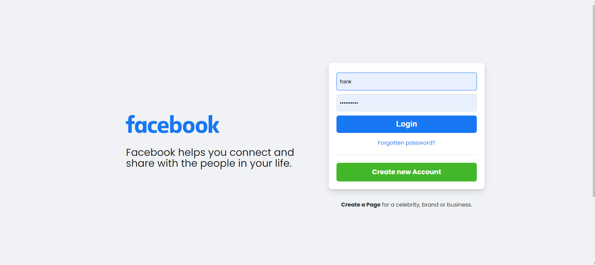
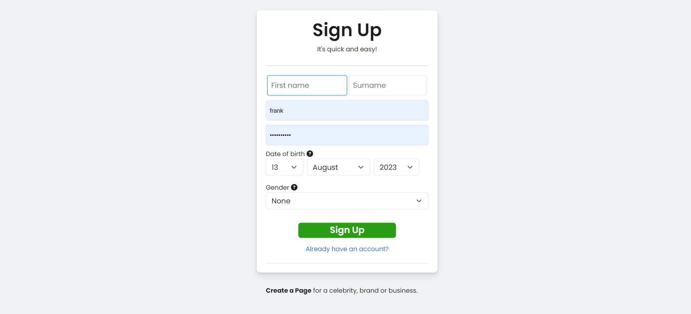
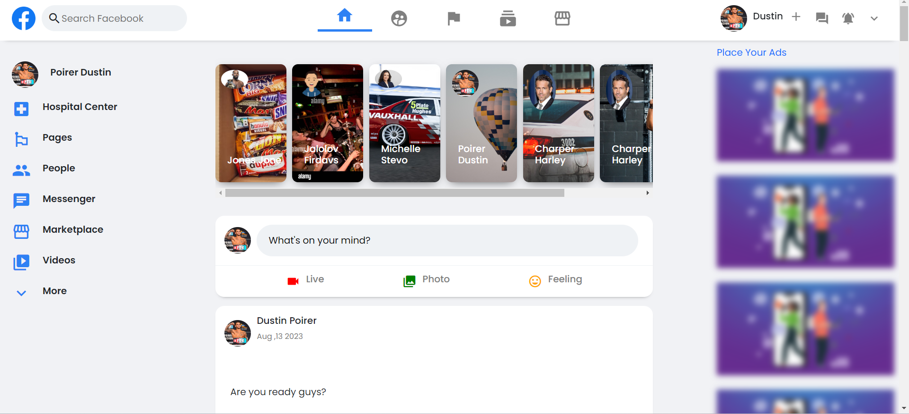
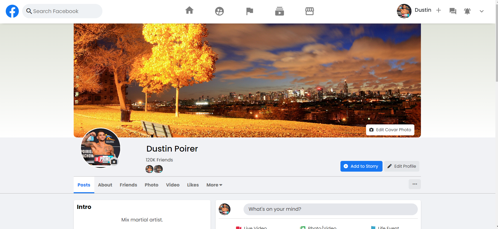
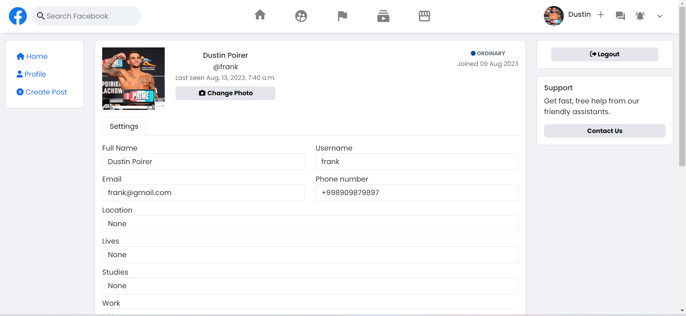
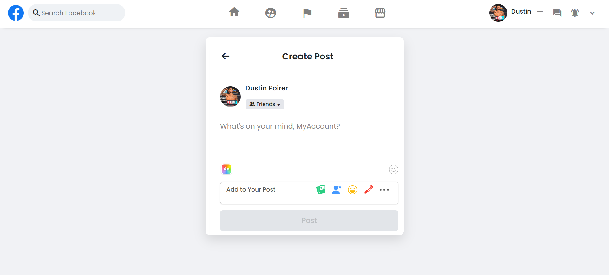
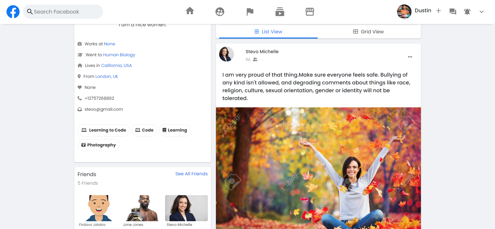
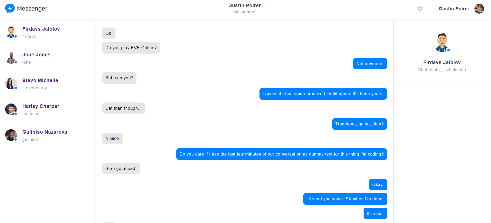

# facebook-clone

Created a Facebook Like
application.                                                                                                                                
----------------Concepts included in the Application-----------------

1. Authentication & Authorization
2. Complex degree of registeration(signup logic)
3. Well handled errors from forms(giving hint to user if anything goes wrong)
4. Complex Friend Functionality implemented(request,accept,decline,cancel friendship)
5. CRUD on post & comment & story & message
6. Well planned DB design for Friend/Post/Comment/Voting Models
7. Logic for seeing only your mutual friends story/posts/feed
8. Upvote or Downvote functionality to the comments
9. Post like (Toggle Like implemented)
10. Setting Expiration time for story as it is in instagram.
11. Messenger(message_app) is implemented. Message to or messaged by functionality and seeing people with the newest
    message at the top logic is done.

___

                    Image Based Overview of the project

___

Login Page

___
Sign Up Page

___

Home Page

___
Profile Page

___
Profile-Edit Page

___
Post Create Page

___
Profile Friends and Self posts page

___
Comment Create/Update/Delete/Upvote/Downvote

___
Facebook Messenger

