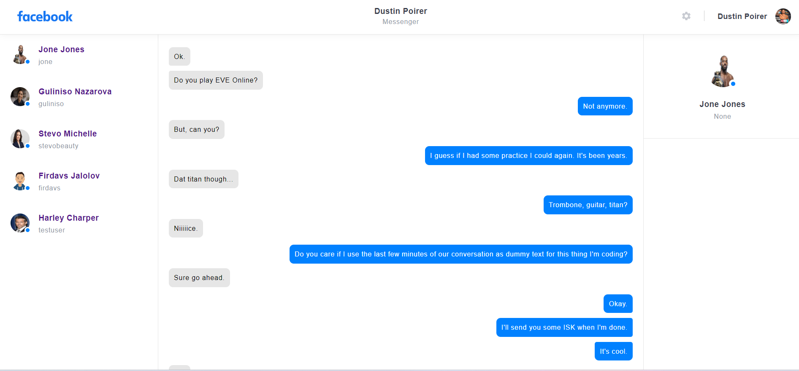

# facebook-clone

Created a Facebook Like
application.                                                                                                                                
# Project setup
1. Authentication & Authorization
2. Complex degree of registeration(signup logic)
3. Well handled errors from forms(giving hint to user if anything goes wrong)
4. Complex Friend Functionality implemented(request,accept,decline,cancel friendship)
5. CRUD on post & comment & story & message
6. Well planned DB design for Friend/Post/Comment/Voting Models
7. Logic for seeing only your mutual friends story/posts/feed
8. Upvote or Downvote functionality to the comments
9. Post like (Toggle Like implemented)
10. Setting Expiration time for story as it is in instagram.
11. Messenger(message_app) is implemented. Message to or messaged by functionality and seeing people with the newest
    message at the top logic is done.

# REST API setup 
1. JWT authentication(AccessToken,RefreshToken) login,logout,signup,verify token,refresh token.
2. Sending asynchronous emails(threading) and confirming user against the code sent.
3. Code resend functionality along with expiration time
4. Full CRUD on post/comment/message
5. Toggle Like, Upvote, Down Vote on API requests
6. All authentication system is built on hand(custom)
___

                                    Image Based Overview of the project

___

Login Page

___
Sign Up Page

___

Home Page

___
Profile Page

___
Profile-Edit Page

___
Post Create Page

___
Profile Friends and Self posts page

___
Comment Create/Update/Delete/Upvote/Downvote

___
Facebook Messenger

